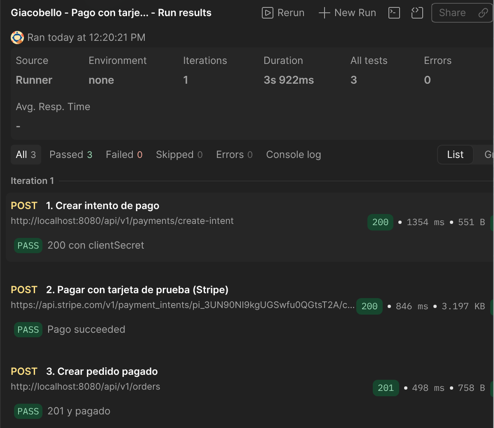

# Giacobello

Backend de la aplicación de restaurante Giacobello. Expone una API para consultar el catálogo y gestionar pedidos, métodos de pago e información relacionada con las facturas.

## ¿Qué es?

Giacobello es el servicio que conecta la aplicación del restaurante con sus datos. Recibe peticiones de otros clientes —por ejemplo, una interfaz web— y trabaja con la información guardada en PostgreSQL.

## ¿Para qué sirve?

Con la API se pueden consultar productos, categorías, mesas y métodos de pago; crear pedidos y actualizar su estado; y consultar facturas e informes. También incluye inicio de sesión con tokens y operaciones de administración para el catálogo.

La API aplica permisos según el tipo de operación, por lo que algunos endpoints requieren autenticación. La lista de rutas y sus ejemplos está en [`docs/endpoints.md`](docs/endpoints.md).

## Instalación y arranque

### Requisitos

- Docker con Docker Compose.
- Java 21, solo si vas a arrancar la app fuera de Docker o a pasar los tests.

### Variables de entorno

Copia la plantilla y pon tus credenciales:

```bash
cp .env.example .env
```

| Variable | Para qué sirve |
|---|---|
| `DATABASE_USERNAME` | Usuario de PostgreSQL |
| `DATABASE_PASSWORD` | Contraseña de PostgreSQL |
| `SPRING_PROFILES_ACTIVE` | Perfil de Spring: `dev` en local |
| `JWT_KEY` | Clave para firmar los tokens JWT (mínimo 64 bytes, HS512). Genérala con `openssl rand -base64 64` |
| `SUPABASE_URL` | URL del proyecto de Supabase. Opcional |
| `SUPABASE_SERVICE_KEY` | Clave `service_role` de Supabase. Opcional |
| `STRIPE_SECRET_KEY` | Clave secreta de Stripe en modo test (`sk_test_...`). Opcional |

### Resumen de ventas automático

Con `SUPABASE_URL` y `SUPABASE_SERVICE_KEY` rellenas, el backend genera cada noche a las 00:05 (hora de Madrid) el PDF de ventas del día anterior y lo sube al bucket `sales-reports` de Supabase Storage como `daily/sales-report-AAAA-MM-DD.pdf`. El bucket tiene que existir y ser privado. Si las variables están vacías, la tarea no se activa y el resto de la app funciona igual. Si rellenas `SUPABASE_URL` pero no la clave, la app no arranca: rellena las dos o ninguna. Si una noche falla la subida, queda en el log como `No se pudo archivar el resumen de ventas` y no se reintenta.

La hora se cambia con `SALES_REPORT_ARCHIVE_CRON` (expresión cron de Spring) y el bucket con `SUPABASE_REPORTS_BUCKET`.

Para subirlo a mano sin esperar a la noche (por ejemplo, en una demo): `POST /api/v1/invoices/report/archive?date=AAAA-MM-DD`. Sin `date` sube el de ayer. Devuelve 503 si Supabase no está configurado y 502 si falla la subida.

### Pago con tarjeta (Stripe, modo test)

Con `STRIPE_SECRET_KEY` rellena (clave `sk_test_...` del dashboard de Stripe en modo test), el cliente puede pagar con tarjeta desde la tablet. Si está vacía, los endpoints de pago responden 503 y el resto de la app funciona igual (efectivo y tarjeta cobrada en barra con `PUT /api/v1/orders/{id}/pay`).

Flujo:

1. El frontend llama a `POST /api/v1/payments/create-intent` con `{ "items": [ { "productId": 1, "quantity": 2 } ] }`. El backend calcula el importe con los precios de la base de datos y responde `{ "paymentIntentId", "clientSecret", "amount" }`. Errores: 400/409 por productos o cantidades inválidos, 503 sin clave, 502 si falla Stripe.
2. Stripe.js confirma el pago en el navegador con la clave publicable (`pk_test_...`, solo en el frontend) y el `clientSecret`.
3. El frontend llama a `POST /api/v1/orders` con `paymentMethodName: "CARD"` y el campo `paymentIntentId`. El backend comprueba en Stripe que el pago está `succeeded`, en euros y por el total exacto del pedido, y crea el pedido ya pagado (`paidAt` informado) con su factura. Errores: 402 si el pago no se ha completado, 409 si el importe no coincide o el pago ya se usó en otro pedido, 400 si `paymentIntentId` no existe, tiene un formato inválido o viaja con `CASH`.

Tarjeta de prueba: `4242 4242 4242 4242`, cualquier fecha futura y cualquier CVC.

#### Probarlo con Postman

Sin frontend se puede probar el flujo entero con la colección [`docs/postman/stripe-pago-tarjeta.postman_collection.json`](docs/postman/stripe-pago-tarjeta.postman_collection.json):

1. Importa el fichero en Postman (**Import**).
2. En la pestaña **Variables** de la colección, pon tu clave `sk_test_...` en `stripeKey`. Postman la guarda en su Vault; no la subas al repositorio.
3. Con el backend arrancado, lanza las peticiones en orden o con **Run**:
   - **1. Crear intento de pago**: guarda el `paymentIntentId` en una variable.
   - **2. Pagar con tarjeta de prueba**: confirma el pago en Stripe con `pm_card_visa`, que hace el papel de Stripe.js.
   - **3. Crear pedido pagado**: crea el pedido con ese pago y comprueba que vuelve `201` con `paidAt`.



Para ver los errores: lanza la 3 otra vez y da `409` (pago ya usado). Si pones `quantity` a `1` y repites 1, 2 y 3, el importe no coincide con el pedido de 2 unidades: da `409` y el pago aparece como devuelto en el dashboard de Stripe.

Límites a tener en cuenta:

- El pago no queda ligado a unos productos concretos, solo a un importe: sirve para cualquier pedido con el mismo total, una sola vez.
- `POST /api/v1/payments/create-intent` es público y no tiene rate limit; está pensado solo para la demo en modo test, no para producción.
- Si el pago se completó pero el pedido no se puede crear (importe distinto, producto no disponible, datos inválidos), el backend devuelve el dinero con un refund en Stripe y responde el error con "el pago se ha devuelto". Si el refund también falla, queda en el log como `No se pudo devolver el pago` con el id del pago y hay que devolverlo a mano desde el dashboard. El importe máximo con tarjeta es 999.999,99 €.

### Opción A: todo en Docker

Levanta PostgreSQL y el backend:

```bash
docker compose --profile app up -d --build
```

La API queda en `http://localhost:8080/api/v1` y Swagger en `http://localhost:8080/swagger-ui/index.html`. Flyway crea las tablas y carga los datos de ejemplo al arrancar.

Para pararlo: `docker compose --profile app down`. Cómo están montados la imagen y el compose: [docs/docker.md](docs/docker.md).

### Opción B: base de datos en Docker y backend en local

Útil para desarrollar, porque la app se reinicia desde el IDE:

```bash
docker compose up -d
env $(cat .env | xargs) ./mvnw spring-boot:run
```

Sin `--profile app`, Compose levanta solo PostgreSQL.

### Tests

```bash
./mvnw clean verify
```

Los tests de integración usan Testcontainers, así que Docker tiene que estar en marcha. El informe de cobertura queda en `target/site/jacoco/index.html`.
