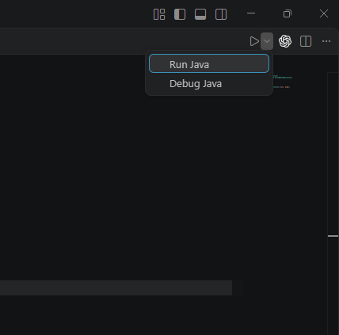

# Giacobello

Backend de la aplicación de restaurante Giacobello. Expone una API para consultar el catálogo y gestionar pedidos, métodos de pago e información relacionada con las facturas.

## ¿Para qué sirve?

Con la API se pueden consultar productos, categorías, mesas y métodos de pago; crear pedidos y actualizar su estado; y consultar facturas e informes. También incluye inicio de sesión con tokens y operaciones de administración para el catálogo.

La API aplica permisos según el tipo de operación, por lo que algunos endpoints requieren autenticación.

## Arranque de Proyecto

Te adjunto los requerimientos necesarios para poder arrancar el proyecto.

Requerimientos:

- Ficheros locales de entorno
    - [Preparación de entorno](https://github.com/FactoriaF5-Asturias/project-p5-digital-academy-team3-restaurant-backend/wiki/Archivos-locales)
- Tener Docker Desktop instalado.
    - [Documentación Docker](https://github.com/FactoriaF5-Asturias/project-p5-digital-academy-team3-restaurant-backend/wiki/Docker)

Si necesitas revisar algo más en la documentación, te dejo el índice [aquí](https://github.com/FactoriaF5-Asturias/project-p5-digital-academy-team3-restaurant-backend/wiki)

Una vez tengas el servicio Docker operativo y los ficheros locales preparados, solo debes posicionarte en `GiacobelloApplication.java`
**Path:** src\main\java\restaurante\team3\giacobello\GiacobelloApplication.java

  
Clickar **Run Java** en la parte superior de la pantalla

## Endpoints

Si quieres revisar los endpoints utilizados en el proyecto te invito eches aquí un vistazo:

**Debes tener el servicio arrancado**

[Formato página](http://localhost:8080/swagger-ui/index.html)  
[Formato JSON](http://localhost:8080/v3/api-docs)